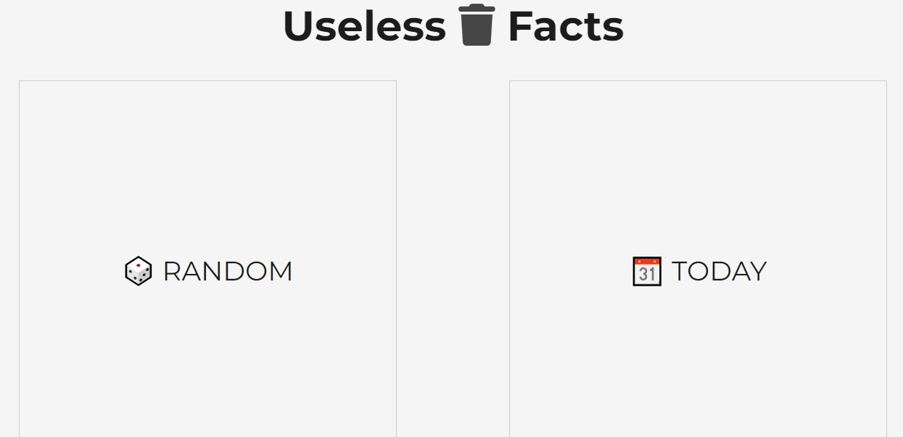
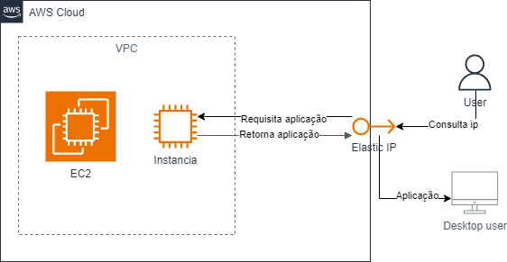
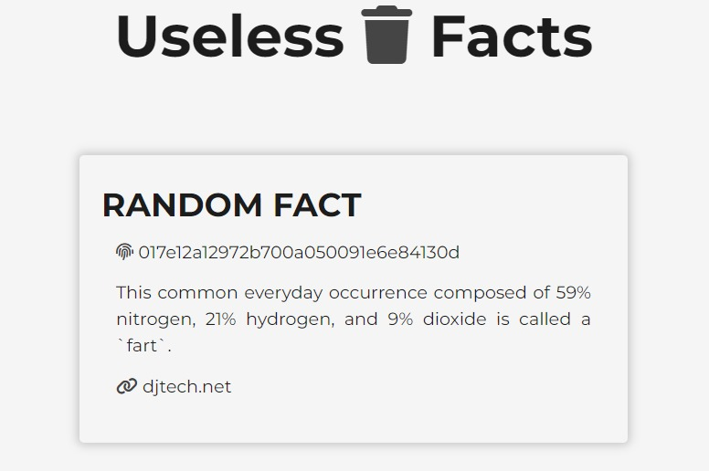
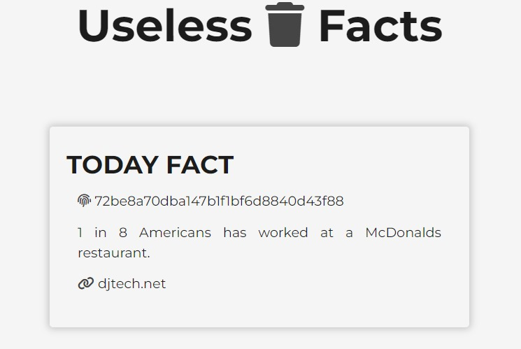

# Projeto - Useless Facts

Este projeto consiste em um site onde através do consumo de uma API é coletado fatos aleatórios e fatos diários e apresentado para o usuário em um template simples e intuitivo. Foi utilizado a API pública Useless Facts para cumprir o propósito do projeto, utilizando de Node.js, Express e Express Handlebars na criação do site.

Projeto destinado para a avaliação da terceira sprint do programa de bolsas Compass UOL para formação em machine learning para AWS.




***

## Índice

- [Desenvolvedores](#desenvolvedores)
- [Desenvolvimento](#desenvolvimento)
- [Estrutura do projeto](#estrutura-do-projeto)
- [Dificuldades](#dificuldades-conhecidas)
- [Tecnologias](#tecnologias)
- [Como utilizar](#como-utilizar)
- [Arquitetura](#arquitetura)
- [Imagens](#imagens)

## Desenvolvedores

- <a href="https://github.com/juhanfreitas">Juhan Freitas</a>
- <a href="https://github.com/21babyhulk">Pablo Guilherme</a>
- <a href="https://github.com/ratelp">Rafael Martinho</a>
- <a href="https://github.com/thiagocoelhoo">Thiago Coelho</a>

## Desenvolvimento

O projeto foi desenvolvido com Node.js para implementação do Backend, express para criar o servidor web e o express handlebars como template engine. A partir da API pública Useless Facts foi feito a coleta dos fatos expressos no site. Após a criação do site, foi implementado a aplicação como uma Imagem no Docker Hub e utilizando de uma instância EC2 na plataforma da AWS foi feito a utilização dessa imagem para rodar um container na instância e assim utilizar o site de maneira pública.

***

### API

<a style = "text-decoration: none; color: #1C1C1C;" href="https://uselessfacts.jsph.pl/"></a>

***

## Estrutura do Projeto

- `src/index.js`: O arquivo onde o servidor Express é configurado.
- `src/routes.js`: Arquivo de rota que executará as requisições HTTP.
- `src/views`: Diretórios para os arquivos de template Handlebars.
- `src/assets`: Diretório para os arquivos estáticos como CSS e Imagens.


***

## Dificuldades conhecidas

- `Acesso a instância EC2`: Durante boa parte da execução do projeto foram feitas diversas tentativas de acesso a instância EC2, que foi resolucionado somente após a criação de uma nova VPC diferente da padrão, após isso ocorreu a normalização e foi feito a utilização com êxito.

- `Criação da arquitetura`: A criação da imagem de arquitetura do projeto, por ser algo novo, ocasionou certa dificuldade para que tentassemos colocar dentro do padrão correto.

***

## Tecnologias

<div style="display: inline_block"><br>
  <a href="https://developer.mozilla.org/en-US/docs/Web/HTML"></a>
  <a href="https://www.w3schools.com/cssref/index.php"></a>
  <a href="https://developer.mozilla.org/en-US/docs/Web/JavaScript"></a>
  <a href="https://nodejs.org/docs/latest/api/"></a>
  <a href="https://expressjs.com/pt-br/"></a>
  <a href="https://github.com/remy/nodemon#nodemon"></a>
  <a href="https://handlebarsjs.com/guide/"></a>
  <a href="https://www.docker.com/"></a>
  <a href="https://aws.amazon.com/pt/"></a>
  
</div>

***

## Como utilizar

### Em caso da instância EC2 estar ativa:

Acesse: 
```
http://54.237.197.92:8000/
```

### Em caso de rodar localmente:
1. Clone esse repositório em sua máquina local
2. Instale as bibliotecas necessárias com `npm install`
3. Copie o conteúdo de `.env.example` para um arquio `.env`
3. Execute `docker-compose up`
4. O site estará rodando no em `3.81.161.237:8000`

***

## Arquitetura



## Imagens

Utilização da aplicação ao ser selecionado botão Random no MENU, onde será consumido da API um fato randômico:



Utilização da aplicação ao ser selecionado botão Today no MENU, onde será consumido da API o fato do dia:



***

## Contribuições

Contribuições são muito bem-vindas! Se identificar alguma melhoria, fique à vontade para abrir uma issue ou enviar um pull request!

***